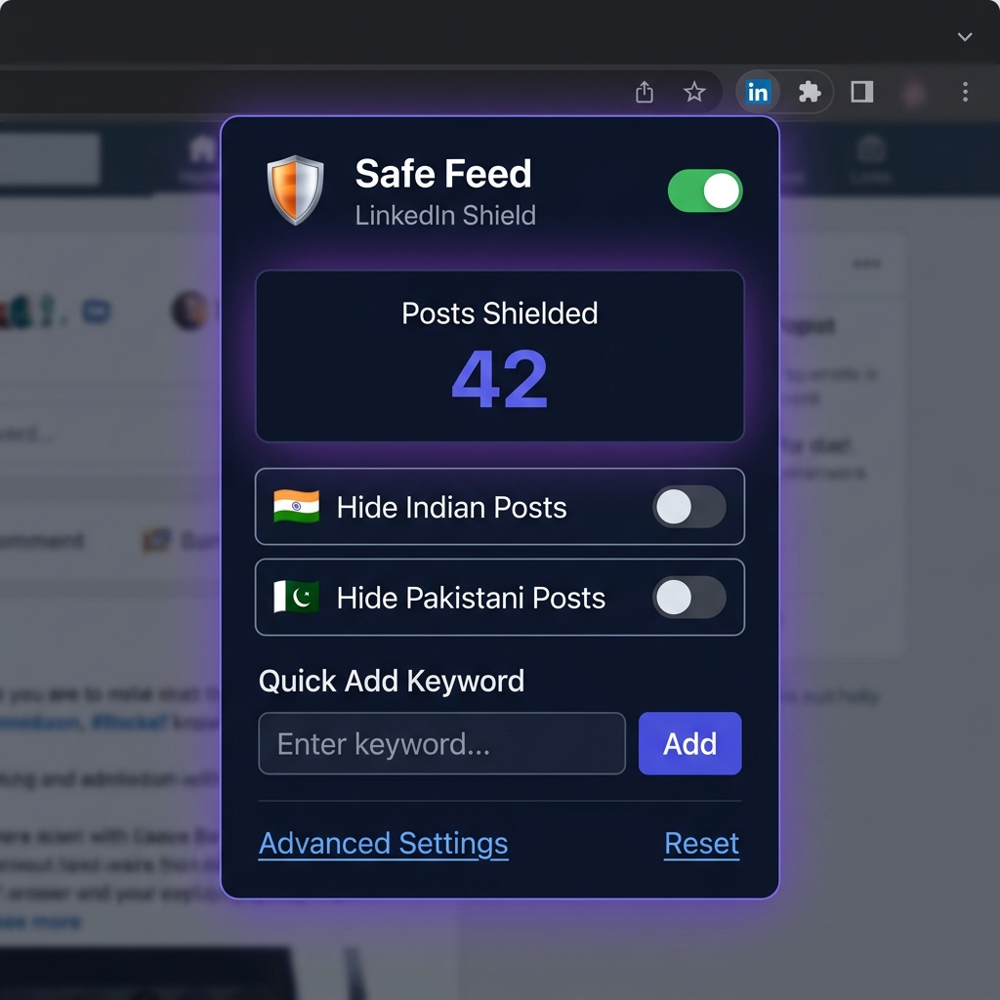

# Safe Feed LinkedIn

Safe Feed LinkedIn is a browser extension designed to help you regain control over your LinkedIn experience. Filter out unwanted posts by location (country, region, city) or custom keywords to keep your feed focused and relevant.

## Features
- **Location Filtering:** Filter posts based on specific geographic criteria.
- **Keyword Filtering:** Hide posts containing unwanted keywords.
- **Customizable:** Manage your filter settings easily through the extension options.

## Installation
1. Download the repository.
2. Open your browser's extension management page (e.g., `chrome://extensions`).
3. Enable "Developer mode".
4. Click "Load unpacked" and select the extension folder.

## Usage
Click the extension icon in your browser toolbar to access the popup, or open the options page to configure your advanced filtering rules.
